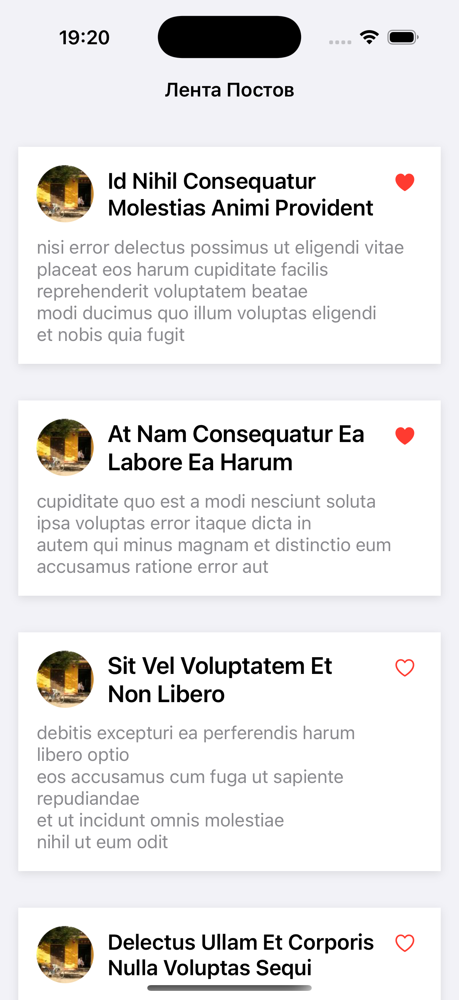
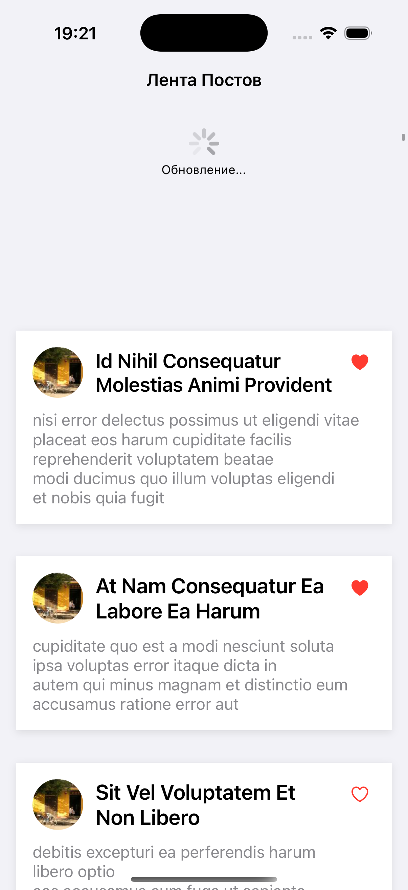
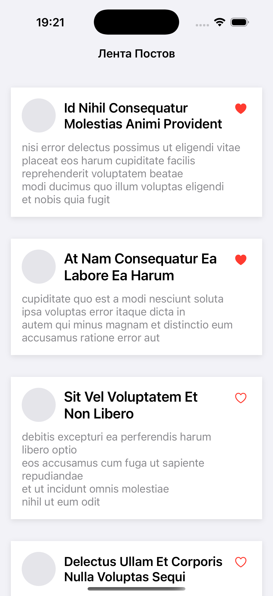

## Описание

TestFeed - это iOS приложение, демонстрирующее современные подходы к разработке мобильных приложений с использованием Swift, UIKit и CoreData. Приложение загружает посты с JSONPlaceholder API и отображает их в виде прокручиваемой ленты с возможностью лайкать посты.

### Основные возможности:
- Отображение ленты постов с аватарами
- Лайки постов с сохранением состояния
- Pull-to-refresh для обновления данных
- Офлайн режим с кэшированием в CoreData

## Архитектура

Приложение построено по принципу MVC (Model-View-Controller)

### Структура проекта:
TestFeed/
Models/Post.swift              
View/PostView.swift           
Controller/FeedViewController.swift 
CoreDataStack.swift      
CoreDataManager.swift         
NetworkService.swift          
AppDelegate.swift              

## Использованные технологии

### Основные технологии:
- Swift
- UIKit
- CoreData
- Alamofire

## Скриншоты

### Главный экран

### Офлайн режим

### Pull-to-refresh

## Cборка

### Требования:
- Xcode 15.6+
- iOS 12.0+
- Swift 5.9+

